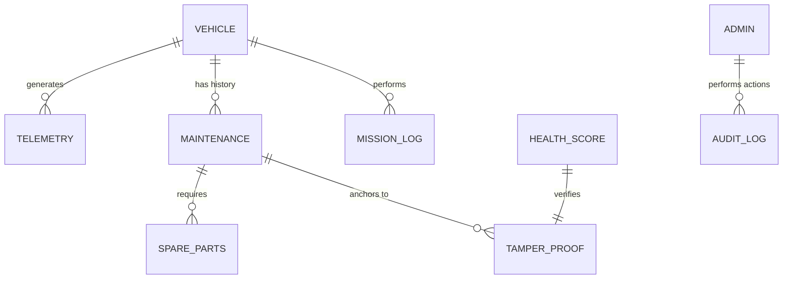

# 🪖 MLOPS: Military Logistics Optimization & Prediction System

### 🛡️ Predictive Fleet Maintenance · Blockchain Auditing · AI-Driven Logistics

---

## 🌟 Project Vision
**MLOPS** is a production-grade enterprise system designed for the Indian Army to transition from reactive maintenance to a **Predictive Readiness** model. By analyzing real-time sensor data from 5,000+ vehicles, the system identifies potential engine failures, classifies fleet health, and anchors every prediction to a blockchain-verified audit trail to prevent data tampering.

---

## 🚀 The Full Stack (Tools & Languages)

| Layer | Technologies | Purpose |
|---|---|---|
| **Frontend** | HTML5, CSS3, JavaScript (Vanilla) | High-performance mission dashboard |
| **Backend** | Python 3.12, Django | Secure API bridge and database management |
| **Database** | MySQL 8.0 | Enterprise fleet data warehouse (12 tables) |
| **ML Engine** | XGBoost, PyTorch, TabNet, Optuna | Ensemble learning for health prediction |
| **Automation** | PowerShell (PS1) | Automated ML training & inference pipeline |
| **Security** | SHA-256 Hashing | Blockchain-inspired immutable audit logs |

---

## 🔄 System Architecture & Flow

The system operates in a continuous loop to ensure operational readiness:

1.  **Telemetry Collection:** OBD-II sensors and mission logs populate the MySQL **Vehicle Telemetry** tables.
2.  **ML Inference:** The system's "Brain" (XGBoost/TabNet ensemble) crunches sensor patterns (coolant, oil pressure, battery voltage) to predict health scores.
3.  **Blockchain Anchoring:** Every prediction is hashed and stored in the **Tamper-Proof Record** table, ensuring logs cannot be modified later.
4.  **Actionable Dashboard:** The Django backend serves these real-time alerts to the JS Frontend, allowing commanders to ground high-risk vehicles before they fail in the field.

---

## 📊 Database Architecture (ER Diagram)

The system relies on a highly normalized 12-table structure. Below is the conceptual relationship:



### Key Engineering Tables:
*   **`Vehicle`**: Core registry of 5,000 tracked assets.
*   **`vehicle_telemetry`**: 1.8+ million rows of live sensor data.
*   **`health_scores`**: Live predictions generated by the ML pipeline.
*   **`tamper_proof_record`**: Immutable digital signatures for every maintenance and ML event.

---

## ⚙️ Quick Start Setup (For Novices)

Follow these 5 steps to get the full system running on your local machine:

### 1. Database Setup
Ensure you have **MySQL 8.0** installed. Run the following command to build the entire fleet structure:
```bash
mysql -u user -puser < database/schema.sql
```

### 2. Environment Configuration
Copy `.env.example` to `.env` and keep local demo credentials:
```env
DB_HOST=localhost
DB_PORT=3306
DB_NAME=mlops_db
DB_USER=user
DB_PASSWORD=user
```

### 3. Install Backend Dependencies
```powershell
python -m venv .venv
.venv\Scripts\Activate.ps1
pip install -r backend\requirements.txt
```

### 4. Run Django Backend (Modular API Layer)
```powershell
python manage.py runserver
```

### 5. Run the ML Pipeline
Execute the automated orchestrator to crunch data and update `health_scores`:
```powershell
.\run_pipeline.ps1
```

---

## 👥 Meet the Team (Group G4)
*Developed at PICT | Dept. of Computer Engineering | 2025–26*

---

<div align="center">
  <b>Built for Operational Excellence and National Security.</b>
</div>
