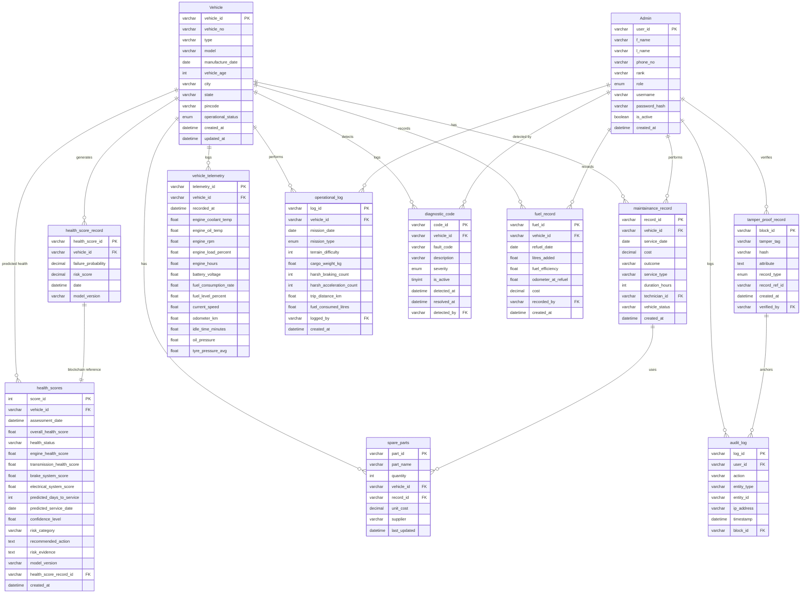

# 📊 Detailed ER Diagram — MLOPS

This document provides a comprehensive attribute-level Entity Relationship (ER) Diagram for the Military Logistics Optimization & Prediction System database (`mlops_db`).

---

## Entity Relationship Diagram

---

## Data Dictionary Highlights

### Core Entities
*   **Vehicle**: The central asset. All operational and health data orbits this entity.
*   **Admin**: System operators who perform maintenance, missions, and audits.

### Operational Data
*   **vehicle_telemetry**: High-frequency sensor data (temperature, pressure, etc.).
*   **diagnostic_code**: FAULT/DTC data with severity levels.

### Reliability & Blockchain
*   **tamper_proof_record**: The security layer. Holds SHA-256 hashes of critical records.
*   **audit_log**: Tracks every change made by Admins, linked to blockchain for immutability.

### ML Output
*   **health_scores**: The result of the Ensemble ML pipeline. Contains subsystem scores (Engine, Braking, etc.) and predictive maintenance schedules.

---
🔙 [Back to README](../README.md)
